# SUMMARY

This project was an individual project done over one week. Based on a project brief (below) the instructions were to build an app to fit that brief using only Ruby, Sinatra, HTML and CSS. The project concluded with a 10 minute presentation at the end.

# VERSIONS

2.0.0 New changes to app  

1.0.4 App released and presented  
1.0.3 CSS added  
1.0.2 Add ability constraint. Only list members to add to tour if ability high enough.  
1.0.1 Add max capacity function. Only allow members to be addd to tour if there is space remaining.  

1.0.0 MVP achieved. Working app.  
 
0.1.5 List all tours in next 30 days on homepage.   
0.1.4 Add index and new bookings function. View all bookings.  
0.1.3 List all members booked on a tour in tour.show  
0.1.2 List all tours a member is registered for (tour id)  
0.1.1 Finish RESTful routes for tours  
0.1.0 Finish RESTful routes for members  
0.0.5 Can create, show and view all members  
0.0.4 Create index for members  
0.0.3 Add functions to find tours by members, members by tours, bookings for both.  
0.0.2: Add CRUD (Create, Read: Find-all & Find-by-id, Update, Delete & Delete-all) functions for Tour, Member and Booking classes  
0.0.1: Add Booking class, pass test of existence of variables.  
0.0.0: Add Tour and Member class, pass test for existence of variables.  

# INSTRUCTIONS FOR RUNNING APP

Running the website locally:  
Clone the repository. To your local device.  

Navigate to the ruby_project folder in your terminal.  

Create a local database:  
`createdb skitour`  

Set up your tables in the local database:  
`psql -d skitour -f db/skitour.sql`  

Seed the initial database:  
`ruby db/seeds.rb`  

Run the app:  
`ruby app.rb`  

In the browser, navigate to the following link to run the app:  

http://localhost:4567/  

# SCREENSHOTS

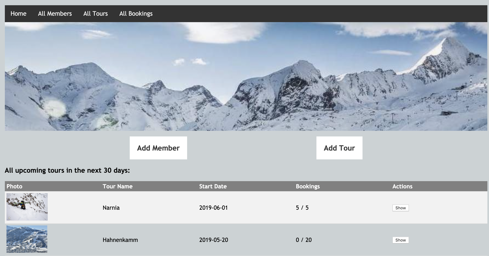
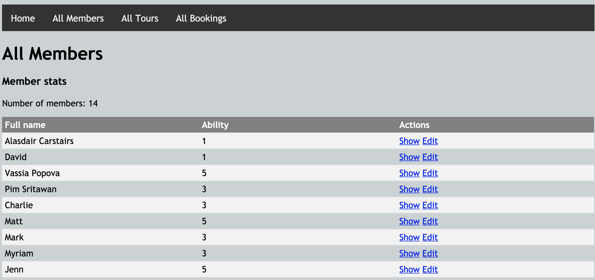
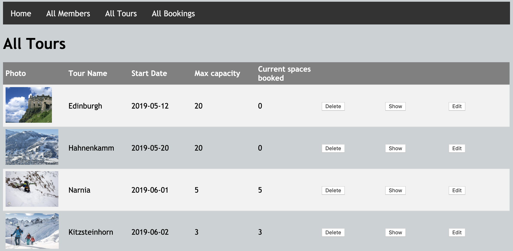
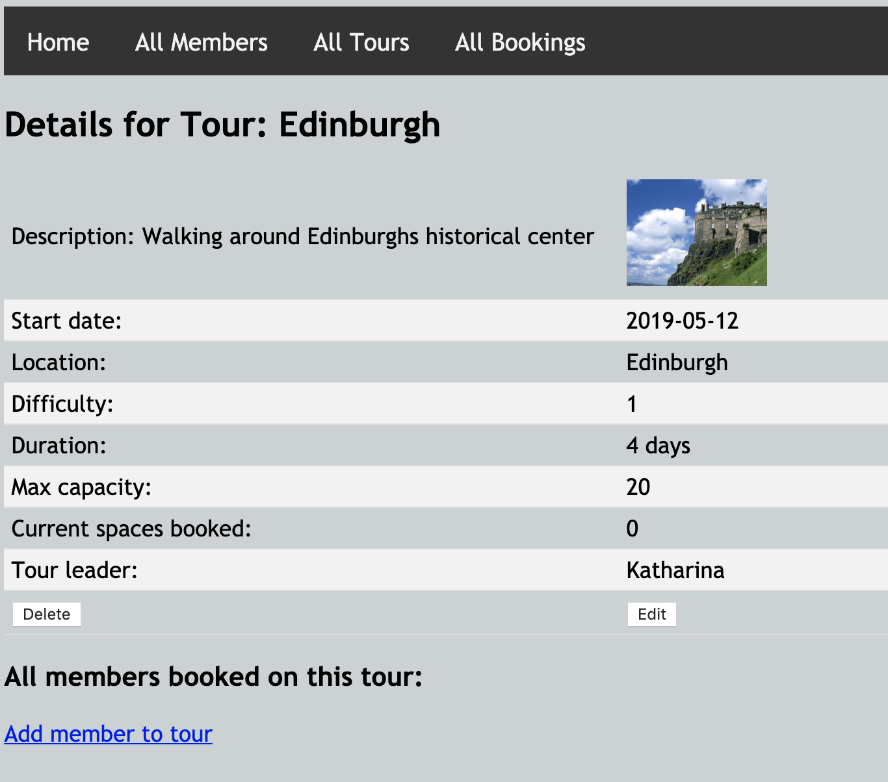
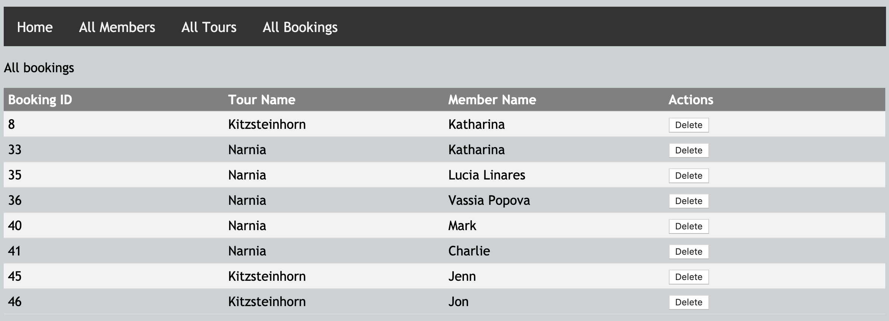

# BRIEF

## MVP

A local gym has asked you to build a piece of software to help them to manage memberships, and register members for classes.  

- The app should allow the gym to create / edit / delete members
- The app should allow the gym to create / edit / delete classes
- The app should allow the gym to add members to specific classes
- The app should show a list of all upcoming classes
- The app should show all members that are registered for a particular class

## Possible Extensions
- Classes could have a maximum capacity, and users can only be added while there is space remaining.
- The gym could be able to give its members Premium or Standard membership. Standard members can only be signed up for classes during off-peak hours.

# PLANNING

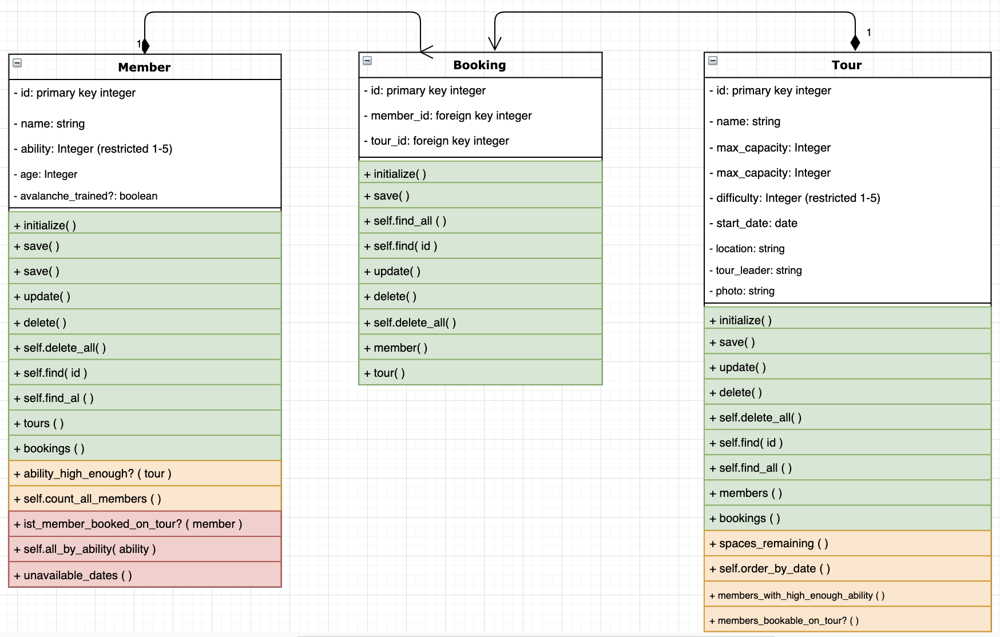
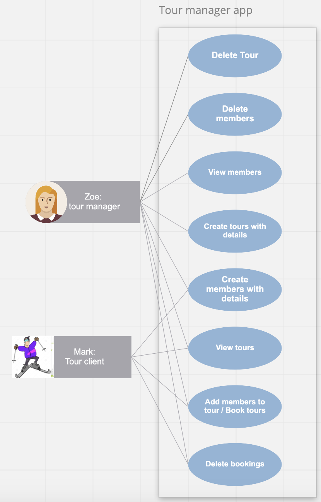
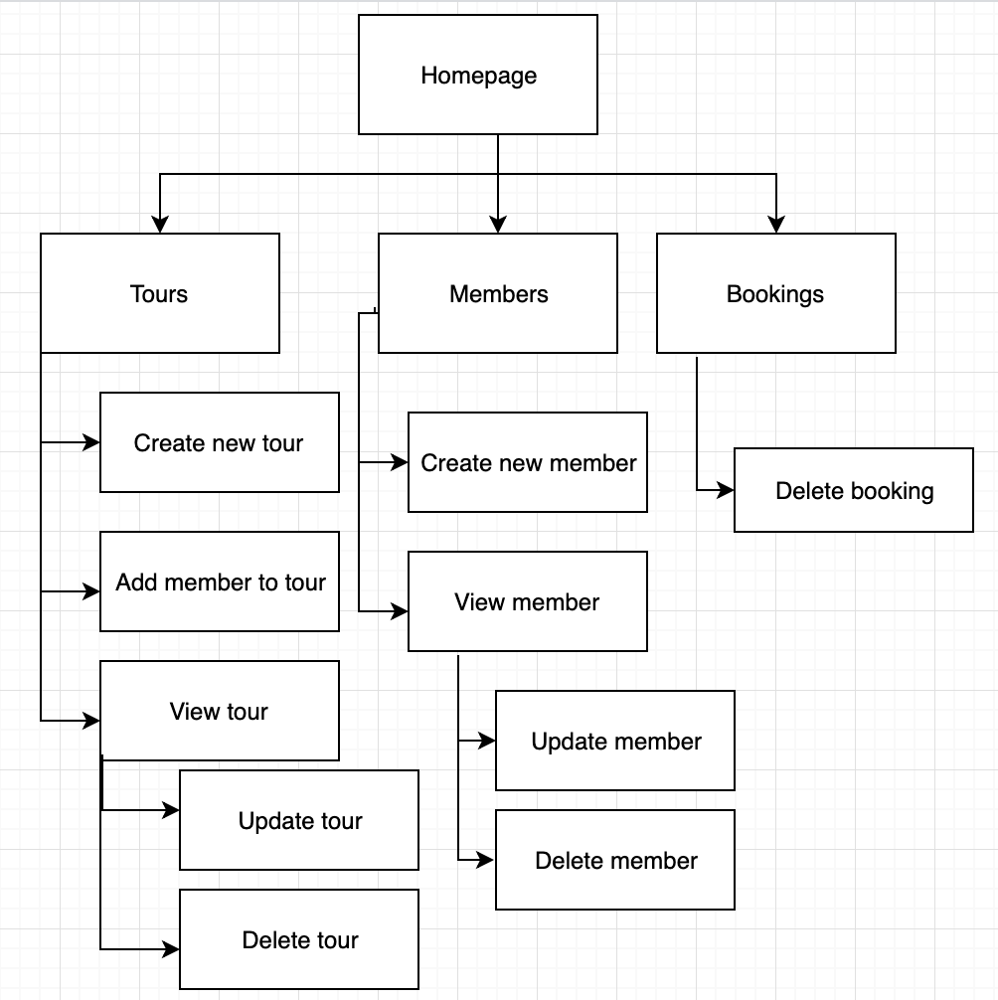

# CODING IRL

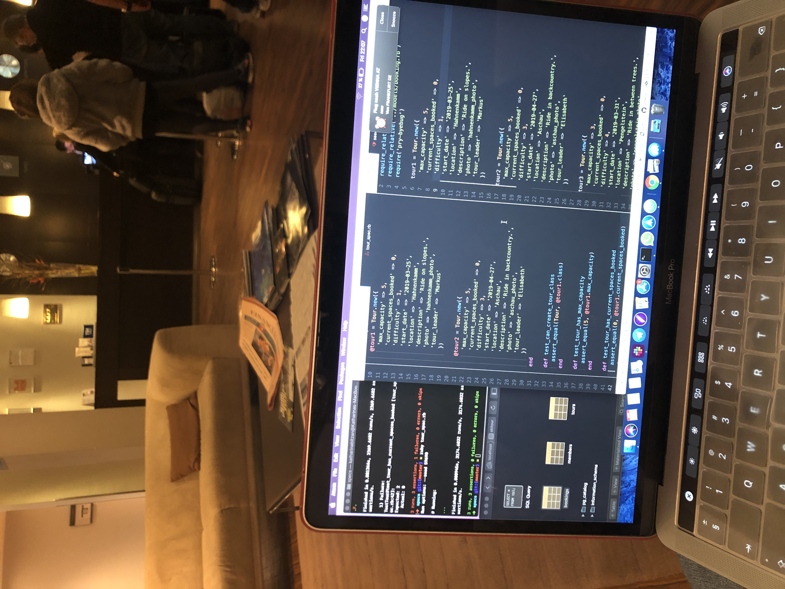
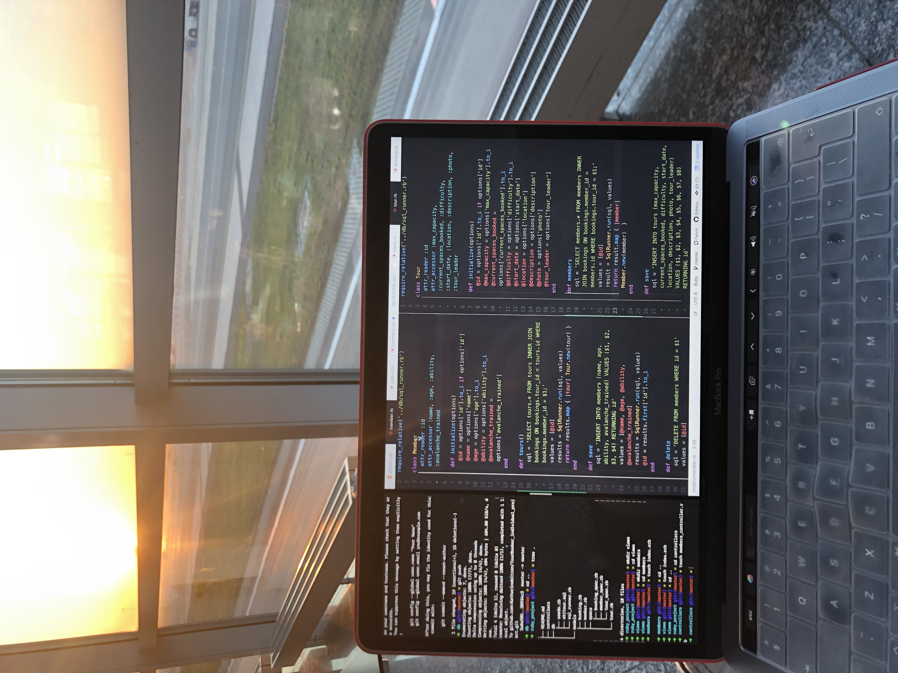

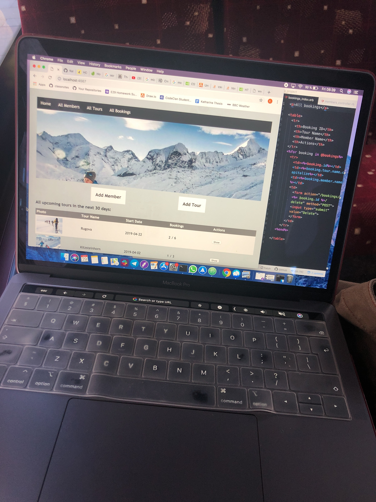
